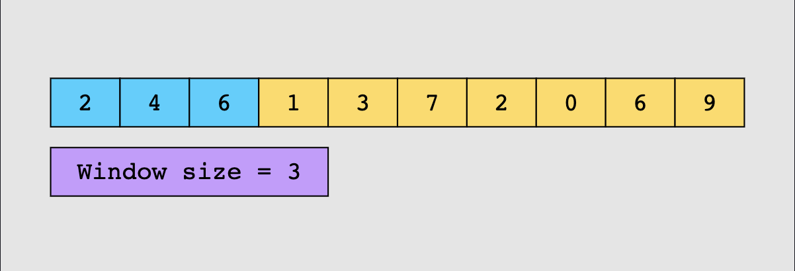
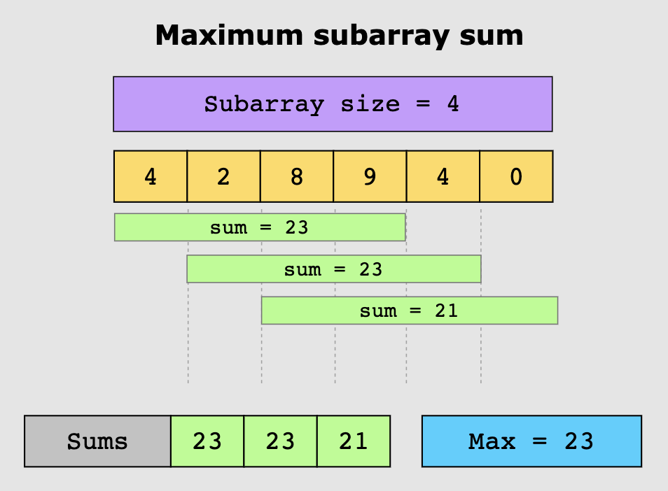

# Sliding Window

### Pattern Overview

- A computational method aimed at reducing the use of nested loops
- A variation of the two pointers pattern, where the pointers can be used to set window bounds
- The sliding window pattern allows us to process data in segments instead of the entire list
- Segment or window size can be set according to the problem’s requirements
- Focus is on the element entering the window and the one leaving it

### Example

    
    The window will slide across the array as you perform computations on the values within the window.

 

    

### Use this pattern if:

- The problem requires repeated computations on a contiguous set of data elements (a subarray or a substring)
- The size of the window may be fixed or variable, depending on the requirements of the problem