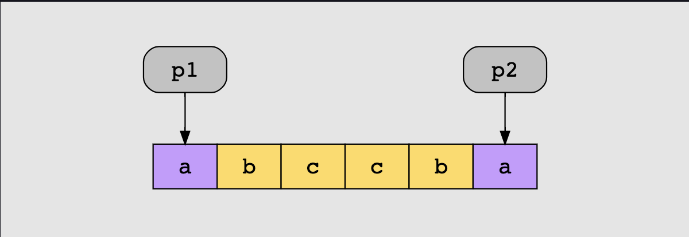
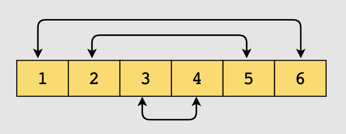

# Two Pointers

### Pattern Overview

- The pattern uses two pointers to iterate over an array or list until the conditions of the problem are satisfied.
- When you need to find two data elements in an array to satisfy a condition, two pointers should come to mind
- The pointers can go in one or two directions

### Example

    
    When checking if a string is a palindrome, we can use two pointers moving towards the middle from both ends, ensuring the values match.

 

    
    When reversing an array, we can use two pointers moving towards the middle from both ends, switching the values at the two pointers.

### Use this pattern if:

- The data can be traversed in a linear fashion (array, linked list, string of characters)
- Data is sorted, symmetrically arranged or arranged in some way relevant to the problem
- We are only considering two elements accessed by the pointers and not the whole set of elements between

### Don't use this pattern if:

 - The problem requires an exhaustive search of the solution space